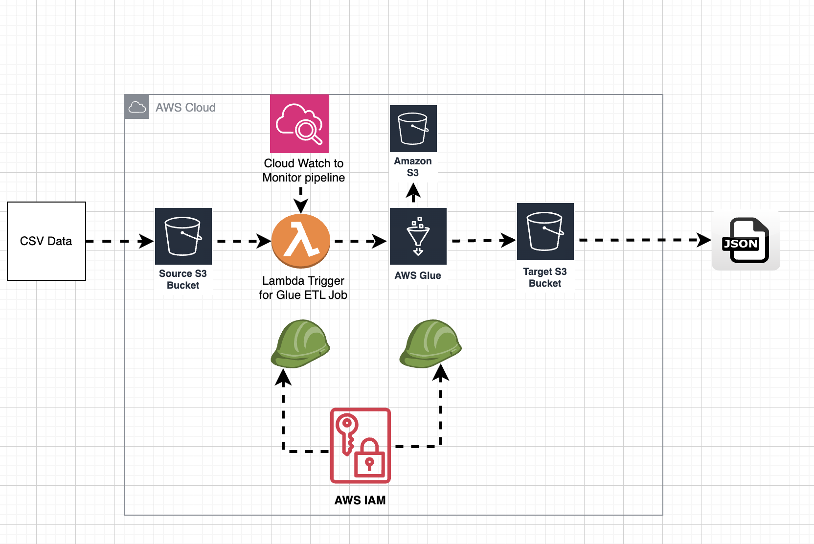
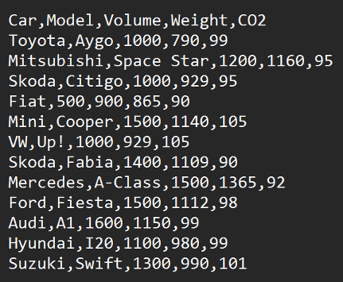
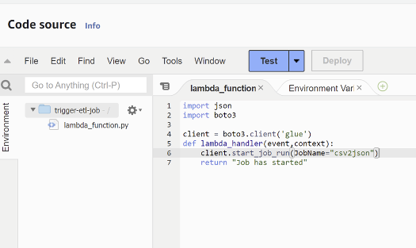
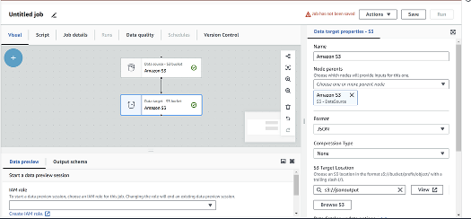
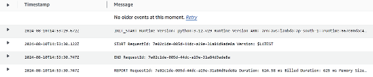
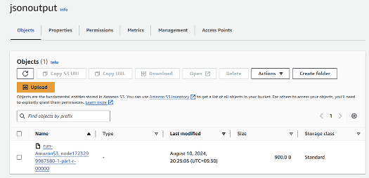
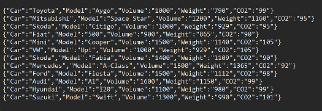

# AWS Serverless ETL Pipeline


**Tech Stack:** AWS Lambda • AWS Glue • Amazon S3 • IAM • Python • boto3 • Event-Driven Architecture • ETL

A production-style serverless Extract, Transform, Load (ETL) pipeline built on AWS that automatically converts CSV datasets into JSON using an event-driven architecture.

---

## Overview

This project demonstrates how multiple managed AWS services can be combined to build a scalable, serverless data processing workflow.

When a CSV file is uploaded to Amazon S3, an event automatically invokes an AWS Lambda function, which starts an AWS Glue ETL job. AWS Glue transforms the dataset into JSON and stores the processed output back in Amazon S3.

The solution eliminates the need to provision or manage servers while showcasing event-driven architecture, cloud automation, and managed ETL services.

---

## Key Technical Highlights

- Event-driven serverless architecture
- Automated ETL workflow using AWS managed services
- CSV to JSON data transformation
- Python-based AWS Lambda orchestration with boto3
- AWS Glue Visual ETL for managed data processing
- Cloud-native architecture with Amazon S3 and IAM
- Reproducible deployment with supporting documentation

---

## Architecture



---

## Architecture Flow

```text
CSV Upload
     │
     ▼
Amazon S3
     │
     ▼
S3 Event Notification
     │
     ▼
AWS Lambda
     │
     ▼
AWS Glue ETL Job
     │
     ▼
CSV → JSON Transformation
     │
     ▼
Processed JSON stored in Amazon S3
```

## Design Goals

- Fully serverless architecture
- Zero infrastructure management
- Event-driven automation
- Reusable ETL workflow
- Easy to extend with additional transformations
- Built using managed AWS services following cloud best practices

---

# End-to-End Workflow

## 1. Upload CSV Dataset

A CSV dataset is uploaded to the source Amazon S3 bucket.



---

## 2. Lambda Function Trigger

Amazon S3 emits an event notification that invokes an AWS Lambda function responsible for starting the AWS Glue ETL job.



---

## 3. AWS Glue Visual ETL Job

The Glue Visual ETL job reads the uploaded CSV file and transforms it into JSON format.



---

## 4. Successful Job Execution

AWS Glue successfully executes the ETL workflow.


---

## 5. CloudWatch Monitoring

AWS CloudWatch logs were used to verify that the Lambda function successfully triggered the Glue ETL job and to troubleshoot execution if needed.



---

## 6. JSON Output Stored in Amazon S3

The transformed JSON dataset is automatically written to the destination bucket.



---

## 7. Resulting JSON Dataset

The transformed records are available in JSON format for downstream analytics or processing.



---

# Features

- Serverless ETL workflow
- Automatic event-driven processing
- CSV to JSON transformation
- AWS Glue job orchestration
- Lambda-triggered automation
- Scalable cloud-native architecture
- Infrastructure designed using AWS best practices
- Documentation for full deployment

---

# AWS Services Used

| Service | Purpose |
|----------|----------|
| Amazon S3 | Stores raw CSV files and processed JSON output |
| AWS Lambda | Triggers the ETL pipeline automatically |
| AWS Glue | Performs the CSV-to-JSON transformation |
| AWS IAM | Provides secure permissions between AWS services |

---

# Repository Structure

```text
aws-serverless-etl-pipeline/
│
├── lambda/
│   └── lambda_function.py
│
├── docs/
│   ├── architecture.drawio
│   ├── architecture.png
│   ├── deployment-guide.md
│   └── screenshots/
│
├── LICENSE
├── README.md
└── .gitignore
```

---

# How It Works

### 1. Upload Data

A CSV dataset is uploaded into an Amazon S3 bucket.

↓

### 2. Event Notification

Amazon S3 automatically emits an event notification.

↓

### 3. Lambda Execution

AWS Lambda receives the event and starts an AWS Glue ETL job.

↓

### 4. ETL Processing

AWS Glue reads the CSV file, transforms the data into JSON format, and prepares the output.

↓

### 5. Store Results

The processed JSON file is written back into Amazon S3.

---

# Lambda Function

The Lambda function acts as the orchestration layer for the pipeline.

```python
import json
import boto3

client = boto3.client('glue')

def lambda_handler(event, context):
    client.start_job_run(JobName="csv2json")
    return "Job has started"
```

Responsibilities:

- Receive S3 event notifications
- Invoke the AWS Glue ETL job
- Enable fully automated processing

---

# Security Considerations

- IAM follows the principle of least privilege.
- Data processing occurs entirely inside AWS managed services.
- No secrets or credentials are stored in the repository.
- Buckets are separated into input and output to simplify data governance.

# Engineering Decisions

## Why Amazon S3?

Amazon S3 provides durable, scalable object storage for both raw input files and transformed output datasets.

---

## Why AWS Lambda?

Lambda enables event-driven execution without managing servers and automatically scales based on incoming events.

---

## Why AWS Glue?

AWS Glue provides fully managed ETL capabilities that simplify large-scale data transformation while eliminating infrastructure management.

---

## Why Serverless?

Using managed AWS services reduces operational overhead, improves scalability, and allows engineers to focus on application logic instead of infrastructure.

---

# Skills Demonstrated

- AWS Cloud Architecture
- Event-Driven Systems
- Serverless Computing
- AWS Lambda
- AWS Glue
- Amazon S3
- IAM
- Python
- Cloud Automation
- ETL Pipelines
- Data Engineering Fundamentals
- AWS Glue Visual ETL
- boto3 SDK
- Cloud Solution Design
- Serverless Architecture

---

# Lessons Learned

This project provided practical experience designing an event-driven serverless data pipeline using managed AWS services. It reinforced cloud architecture concepts such as service orchestration, IAM permissions, event-driven execution, and automated ETL processing while demonstrating how AWS Lambda and AWS Glue can work together to eliminate manual data transformation workflows.

Key takeaways include:

- Designing event-driven cloud architectures
- Automating ETL workflows using AWS Glue
- Triggering cloud workflows with Amazon S3 events
- Implementing Lambda functions with Python and boto3
- Managing IAM permissions between AWS services
- Building scalable, serverless data engineering solutions

---

---

# Challenges & Solutions

| Challenge | Solution |
|-----------|----------|
| Automating data processing without managing servers | Used Amazon S3 Event Notifications and AWS Lambda to trigger processing automatically |
| Transforming uploaded datasets efficiently | Leveraged AWS Glue Visual ETL to convert CSV files into JSON |
| Coordinating multiple AWS services securely | Configured IAM roles allowing S3, Lambda, and Glue to communicate securely |
| Making the workflow reusable | Designed the pipeline as an event-driven architecture that automatically processes every new CSV upload |

---

# Deployment Guide

A detailed deployment walkthrough is available here:

**docs/deployment-guide.md**

---

# Project Status

Completed

The AWS infrastructure used for this project has been intentionally removed after completion to avoid ongoing cloud costs.

The repository includes:

- Architecture diagrams
- Deployment documentation
- Lambda source code
- Complete project explanation

allowing the solution to be reproduced from scratch.

---

# Future Improvements

Potential enhancements include:

- Provision infrastructure using AWS CDK or Terraform
- Add CloudWatch dashboards and custom metrics
- Configure Amazon SNS notifications for failed ETL jobs
- Introduce AWS Step Functions for workflow orchestration
- Integrate the AWS Glue Data Catalog for schema discovery
- Query transformed datasets using Amazon Athena
- Support additional formats such as Parquet and Avro
- Implement CI/CD using GitHub Actions for automated deployment
- Add automated integration tests using LocalStack
- Provision infrastructure with AWS CloudFormation
- Add dead-letter queues for failed processing events
- Add monitoring dashboards for ETL performance metrics

---

# Author

**Phillip-Bryan Kouokam**

Portfolio: https://philbk.dev

GitHub: https://github.com/PhilBKouokam

LinkedIn: https://www.linkedin.com/in/phillip-bryan-kouokam